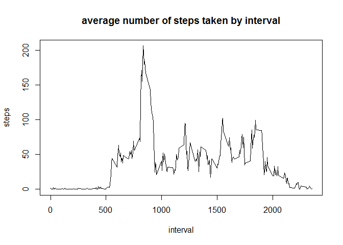

# Reproducible Research: Peer Assessment 1


## Loading and preprocessing the data
The following commands allow to load and process data. the first command create a connection with the file "activity.csv" in compressed one "activity.zip".
the variable "date" is read in R as character then converted in date class with the last command

```r
fichier<-unz("activity.zip","activity.csv")
d<-read.csv(fichier, as.is=2)
rm(fichier)
d$date<-as.Date(d$date)
```


## What is mean total number of steps taken per day?

### histogram of the total number of steps taken each day  
To make a histogram of the total number of steps taken each day, we first construct with tapply function a vector  "stepday" which contains for each day the total number of steps recorded across all day long.  
We note that histogram presents an irregular shape on tail at the left side.
this is due to the presence of missing values which are ignored in the processing. thus they are treated as null values (zeroes).

```r
stepday<-tapply(d$steps, d$date, sum, na.rm=T)
hist(stepday, col="grey", ylim=c(0,30),las=1, main="", xlab="")
title(main="histogram of the total number of steps taken each day", xlab="steps")
```

 
  
### mean and median total number of steps taken per day
mean and median of total number of steps per day are relatively close as shown below


```r
c(mean=mean(stepday, na.rm=T),median= median(stepday, na.rm=T))
```

```
##     mean   median 
##  9354.23 10395.00
```


## What is the average daily activity pattern?
the graph  below shows the average number of steps taken, averaged across all 
days by intervals. we see that activity is very low beetwen 00h00 AM and 05h00 AM. activity is very intense beetwen 05h00 AM and 10h00 AM

```r
y<-tapply(d$steps, d$interval, mean, na.rm=T)
x<-unique(d$interval)
plot(x,y, type="l", xlab="", ylab="")
title(main="average number of steps taken by interval",xlab="interval", ylab="steps")
```

 

```r
temps<-x[which.max(y)]
```
in average the 5-minute interval which contains the maximum number of steps is 835


## Imputing missing values
to impute missing data we choose the mean for 5-minute interval of number of steps across all the days in the dataset. we create a function "impute" which take two arguments a vector x and a function FUN. By default, it imputes missing value of x by mean of non-missing value of x. So we split variable "steps" by  5-minute interval and use "impute" fonction to impute missing value in each part. after that steps is renconstituted and a new data.frame named "di" is created with the missing data filled in.


```r
impute<-function(x, FUN=mean){
        FUN <- match.fun(FUN)
        if(any(is.na(x)) & !all(is.na(x))) x[is.na(x)]<-FUN(x[!is.na(x)])
        return(x)
}

lsteps<-split(d$steps,d$interval)
i.steps<-lapply(lsteps,impute)
i.steps<-unsplit(i.steps,d$interval)

di<-cbind(steps=i.steps,d[,2:3])
```

histogram of the total number of steps taken each day with imputed date presents a shape which is more regular that the first one. 


```r
stepday.i<-tapply(di$steps, di$date, sum, na.rm=T)
hist(stepday.i,col="grey", ylim=c(0,40),las=1, main="", xlab="")
title(main="histogram of the total number of steps taken each day", xlab="steps")
```

 
  
mean total number of steps taken per day computed with imputed data are both higher than the previous ones

```r
c(mean=mean(stepday.i, na.rm=T), median= median(stepday.i, na.rm=T))
```

```
##     mean   median 
## 10766.19 10766.19
```


## Are there differences in activity patterns between weekdays and weekends?
the following syntax create a new variable named "isweekend"  in the data.frame with imputed data "di". this variable indicates whether a given date is a weekday or weekend day


```r
day<-weekdays(di$date)
isweekend<-ifelse(day %in% c("samedi", "dimanche"),1,0)
di$isweekend<-factor(isweekend,labels=c("weekday","weekend"))
```

the figure below is a panel of two plots. the first one is the average across all weekday of number of steps by 5-minute interval and the second is the average across all weekend days of number of steps by 5-minute interval.
coarsely both graphs have approximately the same shape. However, we note that the activities from 5:00 am to 10:00 are more intense on weekdays than during the weekends. Also we note that the difference between the peak of activity (from 5:00 to 10:00) and other peaks is more pronounced  in weekdays than weekend. Moreover, we note that activities  after 10:00 are more intense on weekends than weekdays and the opposite for activities before 10:00.


```r
library(ggplot2)
dtemp<-aggregate(steps~interval+isweekend, FUN="mean", data=di)
qplot(interval,steps,data=dtemp,facets=.~isweekend, geom="line", color=isweekend,main="average number of steps taken by interval")
```

 
